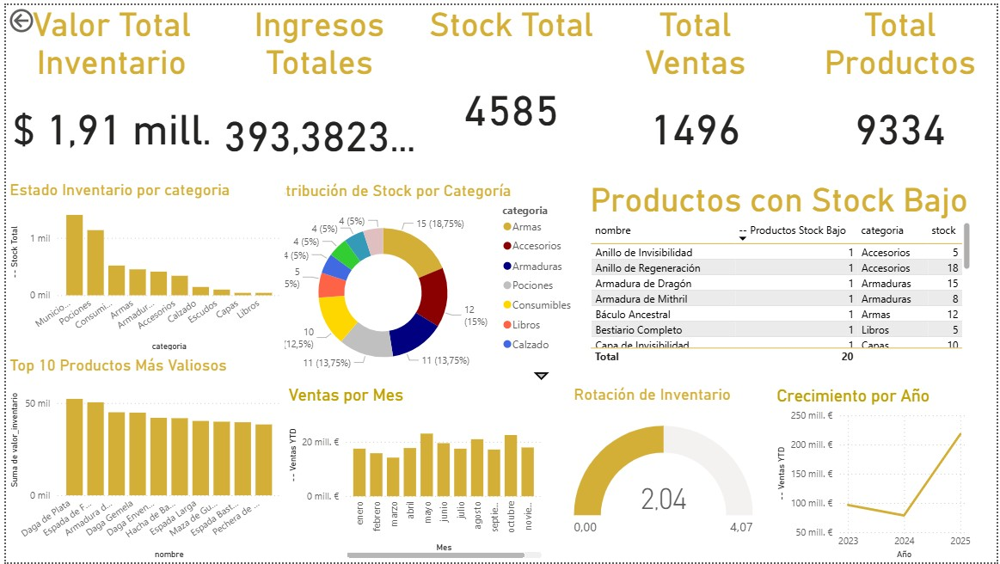

# Power BI - Sprint 4
## Documentación y Archivos

---

## 📁 Archivos en esta Carpeta

### Archivo Principal
- **Sprint4.pbix** - Archivo principal de Power BI (ubicado en esta carpeta Power BI/)
  - **Vista previa**: `dashboard.jpg` (captura del dashboard Sprint 4)

### Documentación Sprint 4

#### Guías Principales
1. **Documentacion_Sprint4.md** - Documentación completa del proyecto Sprint 4
2. **Presentacion_Lectura_PowerBI.md** - Cómo leer y entender tu archivo Power BI
3. **Guia_Paso_a_Paso_Medidas_DAX.md** - Guía paso a paso para crear medidas DAX
4. **Codigo_DAX_Listo_Copiar.md** - Código DAX listo para copiar y pegar
5. **Notebook_DAX_Ejemplos.md** - Ejemplos detallados de código DAX

#### Recursos Adicionales
6. **README_Sprint4.md** - Resumen ejecutivo y guía rápida
7. **procesamiento_datos.py** - Script Python para procesamiento de datos

### Archivos del Sprint 2 (Legacy)
- **measures.dax** - Medidas DAX del Sprint 2
- **measures_SIMPLIFICADAS.dax** - Versión simplificada
- **measures_SIN_COLUMNAS_CALCULADAS.dax** - Versión sin columnas calculadas
- **query_*.m** - Queries de Power Query para carga de datos
- **theme.json** - Tema personalizado
- **layout_instructions.md** - Instrucciones de layout del Sprint 2

---

## 🚀 Inicio Rápido Sprint 4

### Paso 1: Leer el Archivo Power BI
1. Abrir **Presentacion_Lectura_PowerBI.md**
2. Seguir las instrucciones para entender el archivo Sprint4.pbix

### Vista Previa del Dashboard



### Paso 2: Crear Medidas DAX
1. Abrir **Guia_Paso_a_Paso_Medidas_DAX.md** para instrucciones detalladas
2. O usar **Codigo_DAX_Listo_Copiar.md** para copiar código rápidamente

### Paso 3: Documentación Completa
- Consultar **Documentacion_Sprint4.md** para todos los detalles del proyecto

---

## 📋 Requisitos Sprint 4

- ✅ Jerarquías y agrupaciones
- ✅ Al menos 6 métricas con diferentes funciones DAX
- ✅ 3 KPIs completos (valor, objetivo, estado)
- ✅ Análisis temporal (MoM, YoY, YTD)

---

## 📚 Estructura de Archivos

```
tienda-aurelionV4/
└── Power BI/
    ├── Sprint4.pbix                # Archivo Power BI principal
    ├── Documentacion_Sprint4.md    # Documentación completa
    ├── Presentacion_Lectura_PowerBI.md
    ├── Guia_Paso_a_Paso_Medidas_DAX.md
    ├── Codigo_DAX_Listo_Copiar.md
    ├── Notebook_DAX_Ejemplos.md
    ├── README_Sprint4.md
    ├── procesamiento_datos.py
    ├── README_SPRINT4.md           # Este archivo
    └── [Archivos Sprint 2]         # Archivos legacy
```

---

**Última actualización**: Diciembre 2025
**Sprint**: 4  
**Proyecto**: Tienda Aurelion
